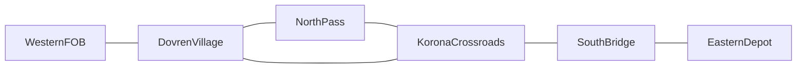

# Draft alpha content and support manifest

Updated: 2026-09-06. **DRAFT — unaccepted. A0 remains open.** This is a reviewable
candidate list, not an inclusion decision, content acceptance, or release promise.
No new asset audit, build, or playtest was run to create it. Existing evidence is
recorded evidence with the limits stated below.

[Alpha Roadmap](Alpha_Roadmap.md) owns order and gates;
[Alpha Progress](Alpha_Progress.md) owns current proof. Detailed source records are
[Content Inventory](Broken_Horizon_1.0_ContentInventory.md),
[Operation Matrix](Broken_Horizon_1.0_OperationMatrix.md), and
[Module Implementation Plan](ModuleImplementationPlan.md).

## Decision rules

- **Candidate:** named for review; neither included nor deferred yet.
- **Included:** requires a recorded alpha scope decision; acceptance proof is still separate.
- **Deferred:** requires an explicit scope decision and destination; absence of proof is not deferral.
- All rows below remain Candidate. No substitutes, new asset paths, named owners,
  quantities, or licensing conclusions are invented here.
- Attack, Defense, Raid, and Resupply are required alpha families. Their candidate
  sites/variants require selection and actual-player acceptance; no family may
  silently disappear when site scope changes.
- Strategic sectors describe campaign state. Physical First Light sites and kits
  describe authored geometry/actors; a strategic name is not proof of the same
  physical location or a connected regional route.

## Current-source strategic graph — not accepted physical connectivity

The architect verified six default sectors in
[BHWarSubsystem.cpp](../../Source/BrokenHorizon/Private/BHWarSubsystem.cpp)
(lines 477-593). The reciprocal strategic graph is connected and has six edges.
These are current defaults, not a locked alpha sector count or a traversal pass.

| Strategic candidate | Default control / type | Reciprocal neighbors |
| --- | --- | --- |
| NorthPass | Neutral / Checkpoint | DovrenVillage, KoronaCrossroads |
| KoronaCrossroads | Enemy / Town | NorthPass, DovrenVillage, SouthBridge |
| EasternDepot | Enemy / LogisticsDepot | SouthBridge |
| WesternFOB | Friendly / HQ | DovrenVillage |
| DovrenVillage | Friendly / Village | WesternFOB, NorthPass, KoronaCrossroads |
| SouthBridge | Enemy / Bridge | KoronaCrossroads, EasternDepot |

WesternFOB -> EasternDepot is an endpoint corridor, not one adjacent convoy edge.
Its shortest strategic chain is four edges: WesternFOB -> DovrenVillage ->
KoronaCrossroads -> SouthBridge -> EasternDepot. The convoy contract checks
`ConnectedSectorIDs` (same source, line 8148); physical field-transport delivery is
separate proof. Restore (line 6933) retains default IDs/adjacency and rejects unknown
saved IDs. Scope decisions must respect that save-compatibility constraint; this
manifest does not propose a migration.

[create_broken_horizon_world.py](../../Content/Python/create_broken_horizon_world.py)
(lines 6, 62-129) declares matching routes in the separate `L_BrokenHorizon_World`.
No fresh map or traversal inspection is claimed. First Light operation markers,
facility kits, and watercraft remain separate physical candidates below.

## Region, operations, and logistics candidates

| ID / candidate | Decision / purpose | Known owner or provenance | Dependencies | Existing technical evidence | Remaining actual-player/content acceptance |
| --- | --- | --- | --- | --- | --- |
| C01 NorthPass / FirstLightAttackA | Candidate; Attack family checkpoint route. NorthPass is strategic; FirstLightAttackA is the physical site marker. | Native operation director/site contract; five BP_EnemySoldier actors and eight cover points recorded. Final asset owner/licensing unresolved by this draft. | Operation-gated activation, ground/navigation, accepted facility/route template. | Authored activation/replicated startup and deterministic completion/travel fixture recorded in operation matrix. | Natural approach/combat/secure/extract/debrief, tactical cover quality, final terrain and readable enemy silhouettes. Deterministic completion is not natural combat proof. |
| C02 DovrenVillage / DefenseA | Candidate; Defense family hold/recovery. Strategic sector and physical Defense A site remain distinct. | Existing Defense A director/garrison fixture; facility art provenance/owner still to assign. | Facility/perimeter/fallback geometry, casualty recovery access. | Q2 records corrected two-client waves, securing, Continue/checkpoints, and ten inspected frames. | Natural controls/tactical quality, facility art, recovery route, and regional reachability. Reuse passed lifecycle rather than implement again. |
| C03 KoronaCrossroads / RaidA | Candidate; Raid family depot sabotage/exfiltration. Strategic sector is not an accepted physical depot assignment. | Existing authored operation-site contract; final patrol/site art owner unknown. | Depot/patrol layout, sabotage interaction, quiet/contested exfil route. | Operation matrix records native variation/site foundation; no natural Raid A acceptance claimed here. | Natural reconnaissance, patrol response, sabotage, extraction, consequences, readable facility/interaction cues. |
| C04 WesternFOB -> EasternDepot | Candidate; Resupply family personnel/supply corridor. Strategic endpoints span the four-edge chain above, not an adjacent convoy edge; physical delivery requires separate verification. | Existing cargo/resupply/transport systems; route production owner unknown. | Reachable staging/delivery sites, cargo vehicle, casualty handling and persisted resources. | Inventory records playable cargo/resupply foundations and authoritative watercraft delivery. | Q5 schema-2 read-only inventory completed; raw transport-property coverage remains false because getters clamp cargo/fuel/hull values. Six overlapping water actors share a WaterID, the boat retains 90-degree pitch at normal startup, and no authored stations or stations in the sampled 3.199/3.760-second startup window were found. These remain separate content/approval work; sampled absence is not permanent runtime absence. Existing helper station-spawn/teleport proves transfer integration only, not authored corridor or destination supply delta. No automatic content repair follows from this finding. Natural boarding/travel/delivery/recovery, road/water choice, save/reload, and no supply dead end remain open. |
| C05 FirstLightWesternFOBKit01 | Candidate; physical resistance-base staging kit. | ABHWorldKitModule, idempotent authored kit; final mesh/material ownership review open. | C04 staging, base interactions and readable signage. | Inventory records three authored kit variants with six valid components. | Base geometry/interiors, material/LOD/collision look review, screenshots, traversal and interaction acceptance. |
| C06 FirstLightDovrenCheckpoint01 | Candidate; physical checkpoint kit; no automatic mapping to every strategic Dovren operation. | ABHWorldKitModule; final asset provenance/owner unresolved. | Selected operation placement and approach/cover template. | Same recorded kit/component foundation as C05. | Verify actual site assignment, tactical geometry, silhouette/signage, collision/interiors and player captures. |
| C07 FirstLightEasternDepotKit01 | Candidate; physical depot/delivery kit. | ABHWorldKitModule; final asset provenance/owner unresolved. | C04 delivery, selected Raid site assignment if adopted. | Same recorded kit/component foundation as C05. | Verify functional placement, delivery/sabotage access, readable depot routes, final art/interiors and captures. |
| C08 FirstLightWaterRoute01 / FirstLightWatercraft01 | Candidate; alternate Resupply traversal, dependent on adopting meaningful water route. | ABHWaterSurface and ABHFieldTransport; recorded project water footstep cue. Final boat/shoreline art provenance unresolved. | C04 endpoints, shoreline access, cargo/waterborne eligibility, safe casualty entry/exit. | Prior inventory records water surface/wading and occupied-player authoritative delivery integration. Current native water geometry synchronizes authored 4200/900/120 volume and actual mesh 4200/900/1 half-extents at construction/post-registration without map edits. Post-fix inventory, ordinary Editor/packaged numeric geometry, 3 water tests, fresh package, review, and final 141-test Validate pass. Code-complete; quick Editor/PIE validation remains. Numeric bounds do not prove rendered appearance or crossing. | Overhead volume/visual comparison and one Simulate inspection, stopping without saving. Resolve duplicate WaterIDs, boat orientation, and receiving-facility content through their separate approval scope. Natural boarding/crossing/delivery/casualty recovery, final boat/material/shoreline, VFX/audio and multiplayer readability remain open. |
| C09 SouthBridge | Candidate; strategic bridge connector between KoronaCrossroads and EasternDepot. | Current BHWarSubsystem default; physical asset/provenance and production owner unknown. | Reciprocal strategic edges, separately verified physical route and save-compatible IDs. | Architect verified default Enemy/Bridge state and adjacency; no fresh physical traversal proof. | Choose inclusion, map the actual crossing, and accept natural traversal/logistics and readable bridge content. |

## Required presentation and equipment coverage

These are coverage obligations for the included gameplay loop, not acceptance of
the entire 1.0 roster. Resolve actual assets and provenance before including a row.

| ID / candidate coverage | Decision / purpose | Known owner or provenance | Dependencies | Existing technical evidence | Remaining actual-player/content acceptance |
| --- | --- | --- | --- | --- | --- |
| P01 Service rifle / BP_Rifle | Candidate; baseline weapon handling and readable combat. | SW_FirstLight_WeaponFire is recorded project-owned; final weapon mesh/material/LOD provenance remains to resolve. | Arms, handling animation, ammo/HUD, muzzle/impact feedback. | Inventory calls service rifle Playable; fire/dry/reload cues load in recorded runtime. | Final asset integration, aim/fire/reload/interruption feel, muzzle/impact VFX and packaged mix. |
| P02 First-person arms | Candidate; required included-weapon presentation. | Ownership/licensing explicitly unresolved in inventory; no accepted substitute named. | Included weapon set, animation and camera interaction. | Inventory status In progress; no accepted arms proof claimed. | Resolve source/license and actual equip/aim/reload presentation across included weapons. |
| P03 Enemy presentation | Candidate; identifiable combat and casualty state. | ABHEnemySoldier project-material silhouettes; Quinn-derived/placeholder skeletal asset remains a recorded blocker. | Selected garrisons/archetypes, uniforms, animation, LOD/collision. | Rifleman kit runtime recorded; Scout/Gunner silhouette foundations exist. | Resolve final mesh provenance, uniforms/material variants, locomotion/hit/death/custody feedback and readable silhouettes. |
| P04 Handling, movement, casualty animation | Candidate; fire/reload, traverse, treatment, stabilization and vehicle recovery. | Exact animation ownership/set unresolved by inventory rows. | P01-P03, actual input, two-ally interaction, transport entry/exit. | Handling/movement/casualty systems recorded Playable. | Dedicated-client timing, interruption/continuity, natural two-player treatment and recovery, final asset handoffs. |
| P05 Audio | Candidate; weapon, water, radio/war and enemy feedback. | Project weapon and water cues recorded; remaining assignments/provenance require inventory resolution. | Included environments/weapons/enemies and spatial mix. | Combined VFX/audio audit records required 18/18 and optional 9/27 coverage; not fresh audit or mix acceptance. | Enemy/guard barks and optional cues, packaged mix, spatial readability and natural player review. |
| P06 VFX | Candidate; muzzle/impact/smoke/weather/damage/extraction cues. | Authored VFX set/ownership not accepted in inventory. | Included weapons, lighting, weather and casualty/extraction states. | Shared readiness counts in P05; smoke runtime Playable. | Authored assignments, density/wind/readability, packaged effects and low-light/MP review. |
| P07 Inventory, loadout and salvage | Candidate; prepare/recover/consume/persist equipment. | Native inventory/salvage systems; asset/interaction presentation owner unassigned. | Included item roles, supply/casualty loop, containers and save contracts. | Inventory records authoritative transfer, consumed-loot/rejoin state and save round-trip. | Natural pickup/transfer/discard, capacity feedback, full intended slot controls, campaign persistence and supply recovery. |

## Proposed support matrix — not accepted

| ID / proposed support | Decision | Existing evidence or current gap | Acceptance required |
| --- | --- | --- | --- |
| S01 2-4 players | Candidate planning default; cap/settings not locked. | Existing scoped two-client fixtures do not accept every proposed count. | Name supported counts/settings, then execute each promised configuration. |
| S02 Listen hosting | Candidate implementation/distribution plan; functional path required by G2. | Fully packaged listen direct-loopback matrix passed: four objectives/two completed, exact rejoin GUIDs, selected local Host actual HUD; no selected remote OnRep claim. NullRHI only; support promise remains unaccepted. | Actual remote/impairment and player controls for promised settings/counts. Session-menu/debrief and wider support acceptance remain separate. |
| S03 Dedicated hosting | Candidate distribution plan; functional path required by G2. | Hybrid Editor dedicated plus two packaged remotes passed direct-loopback objectives/loot/ammo/rejoin and selected remote ID256 OnRep/actual HUD. Installed UE 5.8 supports Editor/Game only; architect verified Server target rejection. Packaged dedicated executable requires an approved server-capable source/custom engine installation. No Server build or metadata workaround was attempted. | Retain hybrid evidence limits; resolve the explicit external engine requirement, then package/validate the promised dedicated executable and deployment. Candidate remains unaccepted. |
| S04 Late join / reconnect | Candidate scenario matrix. | Prior same-process reconnect passed its fixture; current default/hybrid/listen direct-loopback matrix passed fresh remote rejoin with exact six-spawned/one-consumed/five-remaining GUID convergence. Wider support remains unaccepted. | Every promised topology/count, objective/world/loot/ammo convergence and actual connection paths. |
| S05 Host recovery / travel | Candidate scenario matrix. | Prior continuity/travel evidence is scoped. Editor recovery fixture passed actual bound button events, rejected travel, real host loss and same-client direct Join retry without hidden Leave; build/six targeted tests/59 parser cases/review pass. Fresh package and packaged recovery pass; SameProcessReconnect unchanged retry passed 18 assertions, but the first retained-client second-load crash remains an open intermittent reload-reliability finding. Bounded recovery is Verified; final 132-test Validate/build and review close its scoped gate with no supported blocker in the unchanged four files. The crash cannot be declared unrelated or resolved; intermittent map-reload reliability remains open. No supported cause, hardware attribution, or full support acceptance claimed. | Bounded Continue restoration is Verified: request-acceptance compatibility retained, session success waits for actual apply, pending/failed saves reject writes, and successful apply or explicit successful New Game reset releases protection. Editor and fresh packaged 13-phase recovery preserve primary/backup bytes; 5 Persistence.Load and 7 Session tests, 74 parser checks, regressions, review, and final 138-test Validate pass. This is pre-apply failure recovery, not partial rollback or natural pickup/removal. Exact reports are in Alpha Progress; new delivery is tracked by scoped branch history. Resolve the earlier unexplained intermittent reload crash; ordinary Continue through physical input and restored presentation, internet operation, and wider recovery acceptance remain open. Define and validate full campaign recovery without save loss or stale state. |
| S06 Actual controls / settings | Candidate input/settings matrix. | Q2 HUD is verified; Computer Use failed before game input with host ACL error. | Real controls, combat feel, menu/scrolling, supported settings/scales, accessibility and navigation review. |
| S07 Performance | Candidate budgets; hardware/resolution/preset/frame-time/memory targets unlocked. | Valid same-hardware 1080p D3D12 eight-step/two-loop Editor capture fails three unchanged provisional budgets: primitives p95 and pending-stream p95/frame percentage. Packaged first/repeat captures are valid but each fails primitives only; bounded runner review/45 parser cases/final 127-test Validate passed; all three overall budget results remain false; boot capture/180-frame prefix does not prove cache warmth. | Record effective settings, unique UserDirs and owned CSVs; review provisional budgets before accepting targets, then rerun representative worst cases at A5. No comparison to differing August reports. |
| S08 Endurance / remote | Candidate remote, impairment and two-hour-soak scenarios. | No current full support-matrix pass claimed. | Execute promised configurations, record latency/loss scenarios, soak, crashes/desync/save integrity and cleanup. |

Current topology evidence is recorded in [Alpha Progress](Alpha_Progress.md): final
127-test suite, fresh package, matrix/standalone and eight negative cases pass.
These are same-machine NullRHI functional/widget-state checks, not new rendered
pixels, session-menu/debrief, physical-input, internet, or packaged-dedicated-server
acceptance. Optional inventory-transfer/weapon-role modes were not rerun.

## Scope decisions still needed

| Proposal or broader obligation | Current decision | Next scope action |
| --- | --- | --- |
| 6-8 sectors / 4-6-hour first campaign | Candidate planning proposals only. | Name included connected region and measure natural campaign duration; do not infer sites from counts. |
| Four required operation families | Required outcome; candidate sites/variants unaccepted. | Select at least functional coverage for Attack, Defense, Raid and Resupply, then accept actual routes. |
| Full 1.0 arsenal / final content quantities | Neither automatically included nor conclusively deferred. | Decide included roles/assets; retain broader obligations in the 1.0 records. |
| All eight A/B variants | Neither automatically included nor conclusively deferred. | Select alpha variants explicitly; all eight authored/manual rows remain in progress in the 1.0 matrix. |
| Optional escort/rescue | Decision needed, not silently included or deferred. | Adopt explicitly only if scope supports it; record destination for any explicit deferral. |

## A0 review and acceptance record

- [ ] Record included/candidate/deferred decisions, rationale and decision owner/date.
- [ ] Resolve asset provenance, accountable content owner and dependencies for included rows.
- [ ] Name strategic-to-physical mappings and connected routes; validate each rather than equate labels.
- [ ] Lock promised players/topologies/executable distribution/settings and measurable budgets.
- [ ] Attach technical and actual-player/content acceptance separately; temporary art must have explicit nonblocking limits.
- [ ] Preserve all four required families and the complete prepare-to-next-operation campaign loop.

No row is accepted by this draft. A0, G2 functional acceptance, actual controls,
Q1 map approval, performance and complete alpha remain open. Accepted manifest and
G2/template proof precede multiplying campaign content; independent bounded work
may continue under existing authorization.
